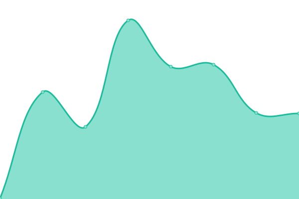
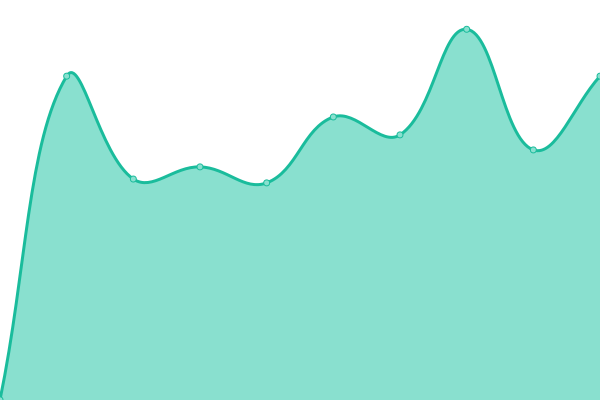
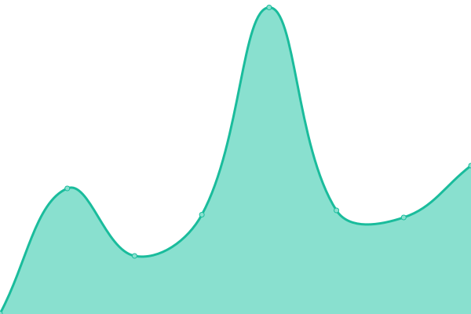
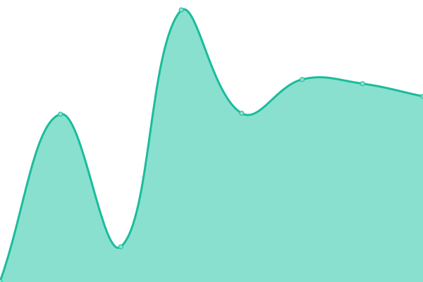

# [📈 Live Status](https://chiotis.github.io/upptime): <!--live status--> **🟧 Partial outage**

This repository contains the open-source uptime monitor and status page for [Christos Chiotis](https://elegrad.com), powered by [Upptime](https://github.com/upptime/upptime).

With [Upptime](https://upptime.js.org), you can get your own unlimited and free uptime monitor and status page, powered entirely by a GitHub repository. We use [Issues](https://github.com/chiotis/upptime/issues) as incident reports, [Actions](https://github.com/chiotis/upptime/actions) as uptime monitors, and [Pages](https://chiotis.github.io/upptime) for the status page.

<!--start: status pages-->
<!-- This summary is generated by Upptime (https://github.com/upptime/upptime) -->
<!-- Do not edit this manually, your changes will be overwritten -->
<!-- prettier-ignore -->
| URL | Status | History | Response Time | Uptime |
| --- | ------ | ------- | ------------- | ------ |
|  [Διάζωμα](https://diazoma.gr) | 🟥 Down | [diazoma.yml](https://github.com/chiotis/upptime/commits/HEAD/history/diazoma.yml) | 

 501ms
     
 | 

<a href="https://chiotis.github.io/upptime/history/diazoma">26.11%</a>
    

|  [Σεράφειο](https://serafio.gr) | 🟩 Up | [serafeio.yml](https://github.com/chiotis/upptime/commits/HEAD/history/serafeio.yml) | 

 1643ms
     
 | 

<a href="https://chiotis.github.io/upptime/history/serafeio">100.00%</a>
    

|  [Unicorg](https://unicorg.gr) | 🟩 Up | [unicorg.yml](https://github.com/chiotis/upptime/commits/HEAD/history/unicorg.yml) | 

 332ms
     
 | 

<a href="https://chiotis.github.io/upptime/history/unicorg">100.00%</a>
    

|  [Chris Blog](https://chiotis.eu) | 🟩 Up | [chris-blog.yml](https://github.com/chiotis/upptime/commits/HEAD/history/chris-blog.yml) | 

 241ms
     
 | 

<a href="https://chiotis.github.io/upptime/history/chris-blog">100.00%</a>
    

|  [Elite Training](https://elitetraining.gr) | 🟩 Up | [elite-training.yml](https://github.com/chiotis/upptime/commits/HEAD/history/elite-training.yml) | 

 1458ms
     
 | 

<a href="https://chiotis.github.io/upptime/history/elite-training">100.00%</a>
    

|  [Circle Flagship](https://circle-flagship.eu) | 🟩 Up | [circle-flagship.yml](https://github.com/chiotis/upptime/commits/HEAD/history/circle-flagship.yml) | 

 1832ms
     
 | 

<a href="https://chiotis.github.io/upptime/history/circle-flagship">100.00%</a>
    

|  [Argonauts](https://argonautsproductions.gr) | 🟥 Down | [argonauts.yml](https://github.com/chiotis/upptime/commits/HEAD/history/argonauts.yml) | 

 1739ms
     
 | 

<a href="https://chiotis.github.io/upptime/history/argonauts">100.00%</a>
    

<!--end: status pages-->

[**Visit our status website →**](https://chiotis.github.io/upptime)

## 📄 License

- Powered by: [Upptime](https://github.com/upptime/upptime)
- Code: [MIT](./LICENSE) © [Anand Chowdhary](https://anandchowdhary.com), supported by [Pabio](https://pabio.com)
- Data in the `./history` directory: [Open Database License](https://opendatacommons.org/licenses/odbl/1-0/)
